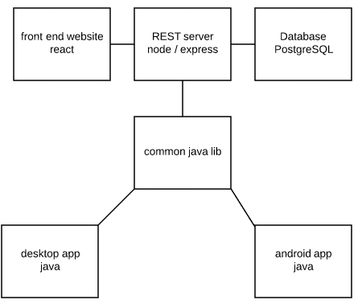
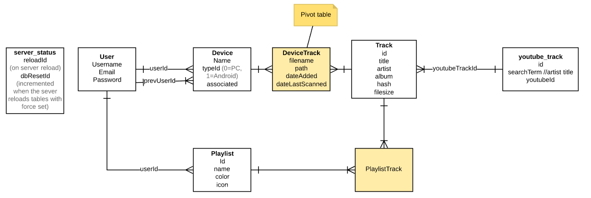
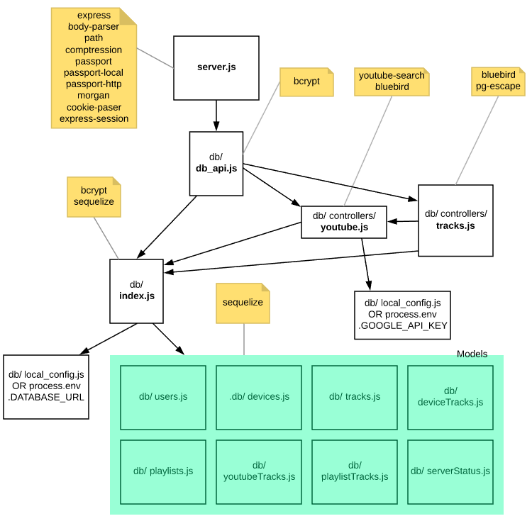

# Technical Design Document

## Abstract
This document is aiming to explain the static and dynamic structure of the systems architecture. Focus will be on explaining these details abstractly, and without much explanation in terms of implementation details e.g. programming language or frameworks.

## Problem Analysis

### Goals, Benefits, Objectives

### Description of requirements

### Assumptions

### Simplifications

## Systems Overview


## Back-End

### Data Model


### Server API

#### Web Client API
endpoint | description | method | auth | input | returns | returns (failure)
---|---|---|---|---|---|---
login|...| post |local || redir to /main | redir to /
register| ... | post | | {username, password, email} | redir to / | 
logout | | get | | | redir to / |
tracks | | get | local | | {[track]} | 404
paths | | get | local | |{[path]} | 404
youtubeId/:hash | | get|local |hash |{youtubeTrackId} |
 playlisttracks/playlistId| |get | local|playlistId |{[playlistTrack]} | 
 playlists| |get |local | |{[playlist]} |
 toggleplaylisttracks   | |post| local |{trackIds:[trackId],playlistId}| 200 | 
  removeplaylisttracks  | |post |local |{trackIds:[trackId],playlistId}| 200 |
 playlisttracks         | |post|local | {trackIds:[trackId],playlistId}| 200 | 
 removeplaylist         | |post|local | {id} | 200 | 
 updateplaylist         | |post|local | {id, name, color, icon} | 200 | 404
 playlist               | |post|local |{name, color, icon} | 200
me                      | |get|local | |200

#### Device Client API
endpoint | description | method | auth | input | returns | returns (failure)
---|---|---|---|---|---|---
register| ... | post | | {username, password, email} | redir to / | 
youtubeId/:hash | | get|local |hash |{youtubeTrackId} |
status | | get | basic http| | {serverStatus} | 
tracks | | post | basic http | {deviceId, tracks:[track]} | 200 | 404
removetracks | |post |basic http |{deviceId, tracks:[track]} |200 | 404
device/:deviceName/:deviceId| |delete|basic http |deviceName, deviceId |200 | 404
device/:deviceName/:deviceType | |get|basic http |deviceName, deviceType | {device} | 404
 mtracks/:playlistId| |get| basic http |playlistId |{[{path, hash, filename}]} |
 mplaylists| |get |basic http | |{[playlist]} |
api/me                  | |get|basic http | |{user}
#### Local Authentication (For website)
- Any api call that fails local authentication will return 404
- User registers an account via the landing web page.
- Username, BCrypted(password) and email are stored in database
- When user logs in, it compares the BCrypted(user input) against the stored password. The password is a one way hash (can't be decoded). Afterwards a session is created with the client using express-session.
- The website fetches data using ``` await fetch('/endpoint', { method: "GET", credentials: 'include' }); ```
- And can post data using 

```
await fetch('/...', {
    method: "POST",
    headers: { 'Content-Type': 'application/json' },
    credentials: 'include',
    body: JSON.stringify({...}),
});
```

- Passport-local is used to handle local authentication on the server 

#### Basic HTTP Authentication (For devices)
- With each request a username and password is sent. As it is sent via HTTPS the data can be assumed secure. For each request the server compares the BCrypted(password) against the stored password. The password is a one way hash (can't be decoded)
- For the devices to send requests (Java) a ```BasicAuthentication``` object is used to initialise a ```HttpRequest``` created from ```NetHttpTransport.createRequestFactory```
- Passport-http is used to handle the http authentication on the server

##### Saved username / passwords
- Username and password are saved on PC as plain text and on android as sharedPreferences.
- It is up to the user to ensure the security/integrity of the devices. Storing saved username/passwords security is beyond the scope of this app

### Candidate Classes
Note: The section following this section outlines a class overview diagram that can help put the following listing in context.
#### server.js 
######Purpose / Functionality:
Defines API endpoints. Sets up server configuration 

######Module.exports
    app

#### db/db_api.js

######Purpose / Functionality:
Defines user, device and server status database CRUD functionality. Acts as facade to server.js exposing functionality provided by controllers. Accesses/modifies models through db/index.js by using ```db.Model.[query/find/create...]``` 

######Module.exports
    authenticateUser
    passportDeserializeUser
    createUser

    registerDevice
    unregisterDevice
    addTracksToDevice
    removeTracksFromDevice

    getServerStatus
    getTracks
    getYoutubeIdForHash
    getUniquePaths

    addPlaylist
    updatePlaylist
    removePlaylist
    addTracksToPlaylist
    removeTracksFromPlaylist
    togglePlaylistForTracks
    getPlaylistsForUser
    getPlaylistTrackIds
    getTrackPathsForPlaylist

#### db/controllers/youtube.js
###### Purpose / Functionality:
Generates youtube search terms and communicates with the youtube search API to find youtube videos for tracks. Stores tracks and search terms in database

###### Module.exports
    generateInitialYoutubeIds
    generateSearchTermArray
    getYoutubeIdForHash

#### db/controllers/tracks.js
###### Purpose / Functionality:
Manages CRUD functionality for users tracks, playlists and other associated data.

###### Module.exports
    addTracksToDevice
    removeTracksFromDevice
    getTracks
    getUniquePaths
    addPlaylist
    updatePlaylist
    removePlaylist
    addTracksToPlaylist
    removeTracksFromPlaylist
    togglePlaylistForTracks
    getPlaylistsForUser
    getPlaylistTrackIds
    getTrackPathsForPlaylist

#### db/index.js
###### Purpose / Functionality:
Sets up database tables and sequelize ORM. Populates initial database data. Reports server status. Exports all database models as ```Tables```.

###### Module.exports
    Tables : {User, Device, Playlist, Track, DeviceTrack, PlaylistTrack, ServerStatus}
#### db/local_config.js
###### Purpose / Functionality:
Local configuration keys for database and google search api.
###### Module.exports
    config 
    googleApi
#### db/[model].js
###### Purpose / Functionality:
Defines a build table function for [model] ORM databse model. The function initialises the model (if necessary) and then returns the (initialised) model object. db/index.js calls all of these functions and stores & exports the models to allow access for controller classes.
###### Module.exports
    build[model]Table

### Diagrams and Explanations

### Justification, Extension, Design Patterns

## Front-End

### Client API
Does the server call the client?

### Website Page Map / Structure

### Wireframes and Descriptions

#### Page 1

### Component List
This is a list of all the frontend components, a grouping of functionality for a related tasks. Components can be broken down into classes. Unless explicitly stated otherwise, all data validation is done server-side and likewise, all data that is displayed is generated server-side.
